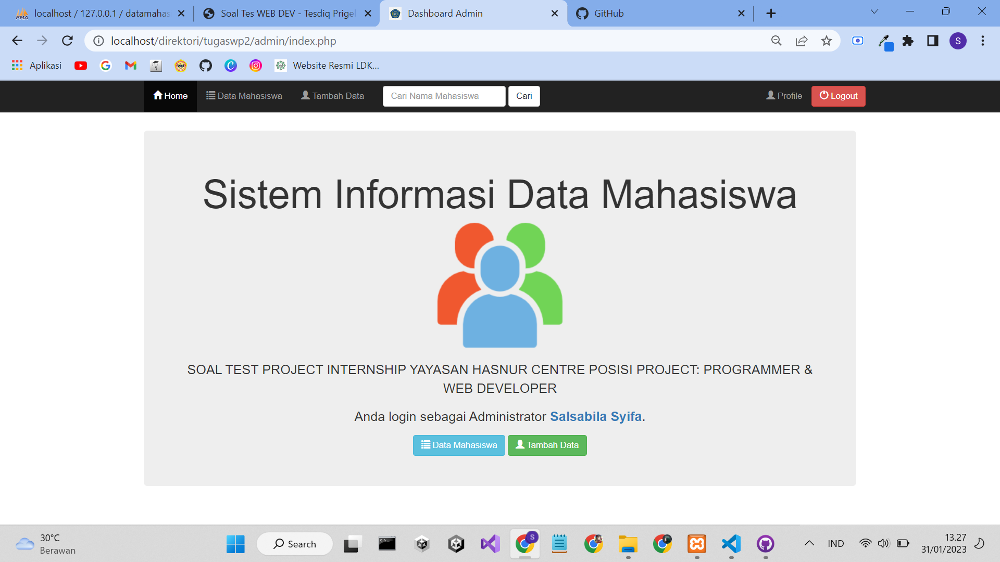
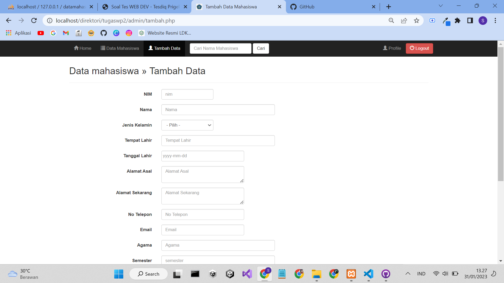
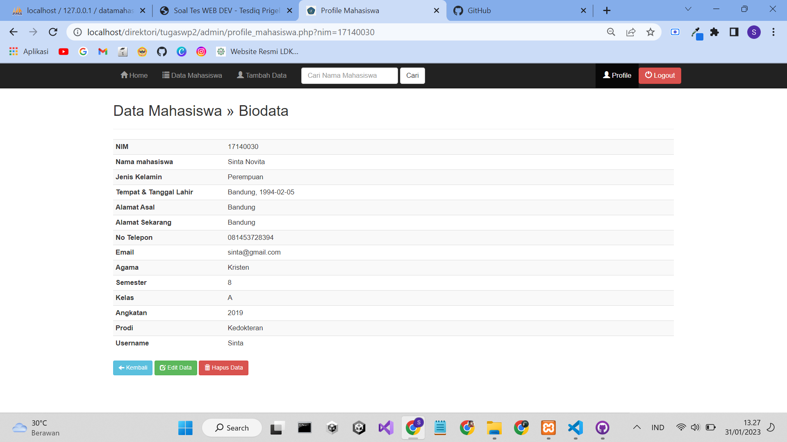
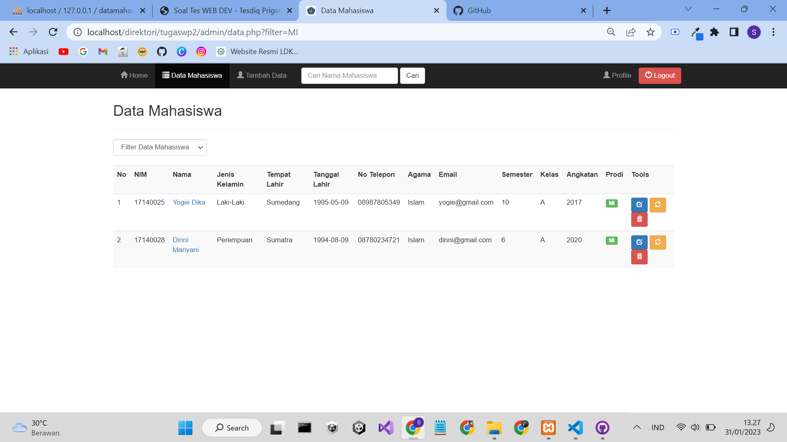

# Sistem Pengelolaan Data Mahasiswa
 
Halaman Indeks Sebelum login

 
Fitur Tambah Data Mahasiswa

 
Fitur Edit Data Mahasiswa

 
Halaman admin untuk menampilkan daftar data mahasiswa

# Fitur
1. Login Data Admin Dan User
2. Tambah Data, Hapus Data Dan Update Data
3. Tabel Data Mahasiswa Dan Tabel Nilai Mahasiswa
# Instalasi
Untuk cara instalasi dan konfigurasi caranya sangat mudah
1. Kalian download repositori ini
2. Selanjutnya letakan folder repositiri ini kedalam `xampp/htdocs/`
3. Buka dengan menggunakan link `http://localhost/namafolder/`
4. Untuk `namafolder` silahkan kalian ganti sesuai nama folder dari aplikasi ini di komputer atau laptop anda
# Login
ADMIN 
Username : admin 
Password : admin123 
